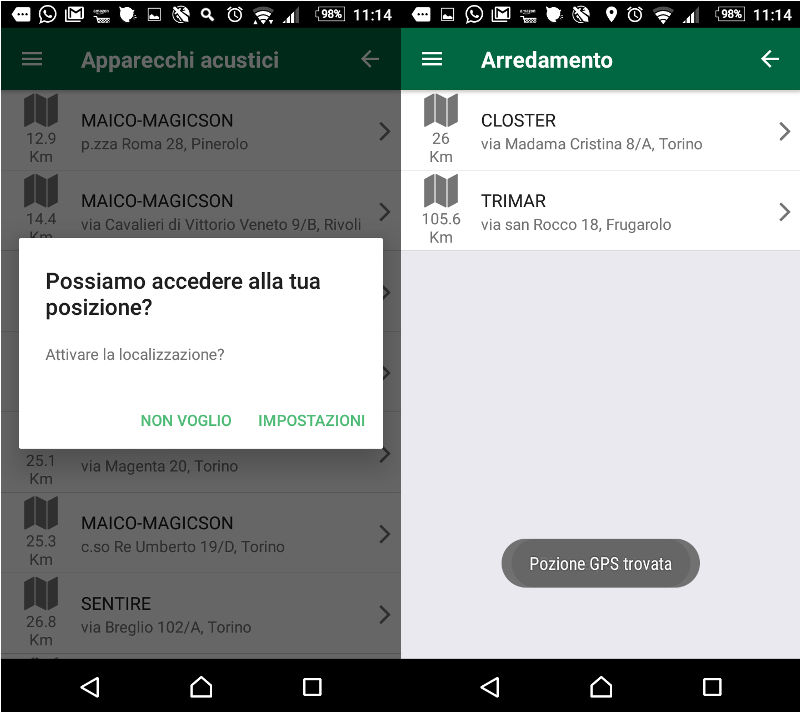
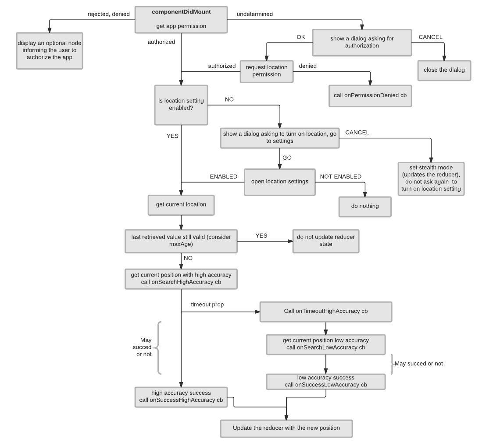

# React Native Location Manager

A redux connected component to manage localization stuff: permission, settings and position state.

## Requirements

- react
- prop-types
- redux
- react-redux
- react-native
- reduxsauce
- seamless-immutable
- react-native-material-dialog
- react-native-settings
- react-native-permissions

Many of these packages come already when starting your project with [ignite](https://github.com/infinitered/ignite).

## Features

Tested with android simulator and real android device (xperia z3c)

- checks for location permission, prompts a dialog asking to authorize the app, if undetermined
- checks for location setting enabled, prompts a dialog asking to enable location, if disabled
- tries to get high accuracy position, with timeout configurable fallback on low accuracy (but high accuracy still running and updating later on if successful)
- manages maxAge (position cache) internally (can't rely on maxAge option param of react-native location methods)
- all texts are customizable
- callbacks can be defined in order to inform the user about what is going on under the hood

## Install

Using npm

    $ npm install --save react-native-location-manager

Ore yarn

    $ yarn add react-native-location-manager

### Additional setup

Some required packages need more setup actions:

    $ react-native link

Please, refer to packages repo pages for further instructions:

- [react-native-vector-icons](https://github.com/oblador/react-native-vector-icons) (required by react-native-material-dialog)
- [react-native-permissions](https://github.com/yonahforst/react-native-permissions)
- [react-native-settings](https://github.com/rmrs/react-native-settings)

## Usage

Add the provided reducer:

    /* ------------- Assemble The Reducers ------------- */
    import { reducer as locationManagerReducer } from 'react-native-location-manager/Redux'

    export const reducers = combineReducers({
      // ...
      location: locationManagerReducer,
      // ...
    })

Inside a connected component

    import React, { Component } from 'react'
    import PropTypes from 'prop-types'
    import { connect } from 'react-redux' }
    import { View, Text } from 'react-native'
    import Toast from 'react-native-simple-toast'
    import LocationManager from 'react-native-location-manager'

    class MyContainer extends Component () {
      static propTypes = {
        location: PropTypes.shape({
          permission: PropTypes.string,
          position: PropTypes.shape({
            latitude: PropTypes.number,
            longitude: PropTypes.number,
            timestamp: PropTypes.number
          }),
          stealthMode: PropTypes.bool
        })
      }

      render () {
        let position = this.props.location.position

        let myPositionText = position === null ? 'Position unknown' : `Lat: ${position.latitude}, Lng: ${position.longitude}`
        return (
          <View>
            <LocationManager
              highAccuracyTimeout={10000}
              dialogTitle={'Can we access you position?'}
              dialogAuthorizeText={'Authorize the app to use the location service?'}
              dialogAuthorizeCancelLabel={'CANCEL'}
              dialogSettingsText={'Please enable location service in order to make me happy'}
              dialogSettingsOkLabel={'SETTINGS'}
              dialogSettingsCancelLabel={'DON\'T BOTHER'}
              deniedPermissionMessage={
                <View style={{ backgroundColor: 'red', padding: 10 }}>
                  <Text style={{ color: 'white' }}>
                    In order to calculate the distance and trip details
                    of each retailer, you must authorize the app to use
                    the location service!
                  </Text>
                </View>
              }
              onSearchHighAccuracy={() => Toast.show('Searching position')}
              onSuccessHighAccuracy={() => Toast.show('GPS position found')}
              onSuccessLowAccuracy={() => Toast.show('Position found')}
              onLocationError={() =>
                Toast.show('Can\'t retrieve your current position')
              }
            />
            <Text>{myPositionText}</Text>
          </View>
        )
      }
    }

    const mapStateToProps = state => (
      return {
        location: state.location
      }
    )

    export default connect(mapStateToProps)(MyContainer)

## Reducer

The reducer provided:

    location: PropTypes.shape({
      permission: PropTypes.string, // one of authorized, denied, undetermined, restricted
      position: PropTypes.shape({
        latitude: PropTypes.number,
        longitude: PropTypes.number,
        timestamp: PropTypes.number // when it was fetched?
      }),
      stealthMode: PropTypes.bool // set to true when the user closes the dialog without going to location enable settings page
    })

The `stealthMode` variable is used in order to stop asking the user to enable location setting every time the
component renders, if someone doesn't want to share its position, why should we annoying him?

## API

`LocationManager` props:

| Prop                       | Type     |      Default                                      |  Description     |
|----------------------------|----------|---------------------------------------------------|------------------|
| dialogTitle                | String   | Possiamo accedere alla tua posizione?             | Title of the modal dialog which pops up when the user has not given app permission to retrieve location, or location setting is disabled |
| dialogAuthorizeOkLabel     | String   | OK                                                | Label of the OK button when the dialog ask for location permission |
| dialogAuthorizeCancelLabel | String   | ANNULLA                                           | Label of the CANCEL button when the dialog ask for location permission |
| dialogAuthorizeText        | String   | Dai il permesso per rilevare la tua posizione?    | Dialog text when the dialog ask for location permission |
| dialogSettingsOkLabel      | String   | IMPOSTAZIONI                                      | Label of the OK button when the dialog ask to enable setting |
| dialogSettingsCancelLabel  | String   | NON VOGLIO                                        | Label of the CANCEL button when the dialog ask to enable setting |
| dialogSettingsText         | String   | Attivare la localizzazione?                       | Dialog text when the dialog ask to enable setting |
| deniedPermissionMessage    | Object   | <Text>Autorizzazione localizzazione negata</Text> | Node shown to inform the user that location authorization was denied (can't prompt the user for authorization again) |
| onPermissionDenied         | Function | () => {}                                          | Callback called when the user denies location permission to the app |
| maxAge                     | Number   | 30000                                             | Cache time for the position to be considered still valid |
| onLocationError            | Function | () => {}                                          | Callback called when the position cannot be retrieved |
| highAccuracyTimeout        | Number   | 10000                                             | Timeout fot the high accuracy request |
| onSearchHighAccuracy       | Function | () => {}                                          | Callback called when searching with high accuracy |
| onSuccessHighAccuracy      | Function | () => {}                                          | Callback called when high accuracy position is succesfully retrieved |
| onTimeoutHighAccuracy      | Function | () => {}                                          | Callback called when high accuracy request timeouts |
| onSearchLowAccuracy        | Function | () => {}                                          | Callback called when searching with low accuracy |
| onSuccessLowAccuracy       | Function | () => {}                                          | Callback called when low accuracy position is succesfully retrieved |

The `Utils` module also exports 2 useful functions:

    import { distance, getLocation } from 'react-native-location-manager/Utils'

### distance

    distance (lat1, lon1, lat2, lon2)

#### Params

- `lat1`
- `lon1`
- `lat2`
- `lon2`

The latitude and longitude of the 2 points

#### Returns

The distance between 2 LatLng points

### getLocation

    getLocation (
      onSuccess,
      onError,
      options,
      // wanna display messages?
      onSearchHighAccuracy = () => {},
      onSuccessHighAccuracy = () => {},
      onTimeoutHighAccuracy = () => {},
      onSearchLowAccuracy = () => {},
      onSuccessLowAccuracy = () => {}
    )

#### Params

- `onSuccess(coords)`: cb called when the position is retrieved. It may be calles 2 times, the first with low accuracy position and later on with high accuracy position
- `onError(error)`: cb called when the position cannot be retrieved
- `options`:
    - `options.timeout`: high accuracy request timeout (after this interval the low accuracy request is performed, but the previous high accuracy request continues!)
- `onSearchHighAccuracy`: function called when requesting the high accuracy position
- `onSuccessHighAccuracy`: function called when the high accuracy request is successful
- `onTimeoutHighAccuracy`: function calles when the timeout interval is gone (so the low accuracy request is going to be performed)
- `onSearchLowAccuracy`: function called when requesting the low accuracy position
- `onSuccessLowAccuracy`: function called when the low accuracy request is successful

## Contribute

Contributions are very much appreciated, please make sure your code is compliant with the following `eslintrc`:

    {
      "parser"  : "babel-eslint",
      "extends" : [
        "standard",
        "standard-react"
      ],
      "plugins" : [
        "babel"
      ],
      "env"     : {
        "node" : true
      },
      "rules": {
        "semi" : [2, "never"],
        "max-len": [2, 120, 2],
      }
    }
